# Financial News Analyst — Multi-Agent GenAI System

A capstone project demonstrating a **multi-agent AI architecture** that combines live
financial data, real-time news, and RAG-powered historical context to generate
structured investment research summaries — with full user authentication, an admin
panel, and automated RAG quality evaluation.

> **Disclaimer:** All outputs are for educational and informational purposes only.
> This system does **not** provide financial advice.

---

## Architecture



```
User Query
    │
    ▼  JWT Bearer
┌───────────────────────────────────────────┐
│         FastAPI REST API (:8000)           │
│  JWT · Rate Limit · Prometheus · PII      │
└──────────────────┬────────────────────────┘
                   │
                   ▼
        ┌─────────────────────┐
        │   Supervisor Agent  │
        └──┬─────────┬────────┘
           │         │         │
           ▼         ▼         ▼
      Data Agent  News Agent  Analysis Agent
      (MCP)       (MCP)       RAG → LLM → Verify
           │         │         │
           ▼         ▼         ▼
      Finnhub   NewsAPI    Qdrant + evaluation.py
                 + RSS
```

### Agents

| Agent | Role | Transport |
|---|---|---|
| **Supervisor** | Sequential orchestrator — runs agents in order, aggregates state | In-process |
| **Data Agent** | Extracts tickers, fetches live price / profile / market cap via Finnhub | MCP stdio |
| **News Agent** | Builds query, fetches recent articles via NewsAPI + 11 RSS fallbacks | MCP stdio |
| **Analysis Agent** | Upserts data into Qdrant, retrieves RAG context, calls GPT-4o-mini, verifies claims | In-process |

### MCP Servers

| Server | Tools | Description |
|---|---|---|
| `market_server.py` | `get_market_data(ticker)` | Wraps Finnhub SDK — price, volume, fundamentals, profile |
| `news_server.py` | `fetch_financial_news(query, max)` | NewsAPI primary, 11 RSS feeds as automatic fallback |

---

## Features

| Area | What's included |
|---|---|
| **Auth** | Registration · Login · JWT Bearer tokens · Cookie session persistence across browser refresh |
| **Roles** | Admin (user management) · Regular user (analysis only) |
| **Admin panel** | List users · Block/Unblock · Reset password · Delete · Token usage per user · RAG Evaluation aggregate |
| **Analysis** | Live market data · News aggregation · RAG context · GPT-4o-mini · Hallucination score · Source chips |
| **History** | Per-user SQLite history · Rating (1–5) + free-text feedback · PII redaction · Consent flag |
| **RAG Evaluation** | Precision@K · MRR · Cosine similarity · ROUGE-1 · Traceability · Hallucination · Bias · Composite score |
| **Observability** | Prometheus metrics · CPU/RAM gauges · Structured logging · Trace IDs |
| **Safety** | Prompt-injection blocking · Content moderation · PII redaction · Rate limiting · Token quota |
| **Resilience** | Stub mode (no API key) · RSS fallback · Local embeddings fallback · In-memory Redis fallback |

---

## Project Structure

```
financial_news_analyst/
├── main.py                     # Uvicorn entry point
├── run.py                      # Launches FastAPI + Streamlit together
├── architecture.png            # System architecture diagram
├── BLUEPRINT.md                # Full architecture blueprint + NFR coverage
├── app/
│   ├── agents/
│   │   ├── supervisor_agent.py # Orchestration + trace propagation
│   │   ├── data_agent.py       # Ticker extraction + market MCP
│   │   ├── news_agent.py       # News MCP
│   │   └── analysis_agent.py   # RAG + LLM + verify + cache
│   ├── api/
│   │   ├── app.py              # FastAPI factory + middleware
│   │   ├── routes.py           # All REST endpoints incl. /rag/evaluate
│   │   ├── auth_routes.py      # /auth/login, /register, /me, /config
│   │   ├── deps.py             # JWT dependency + require_admin
│   │   └── limits.py           # Shared SlowAPI limiter
│   ├── core/
│   │   ├── config.py           # All settings from env vars
│   │   ├── history.py          # Conversation persistence + token sums
│   │   ├── users_store.py      # User accounts · block/unblock · bcrypt
│   │   ├── jwt_tokens.py       # Token create/decode (HS256)
│   │   ├── security.py         # Input validation + content moderation
│   │   ├── pii.py              # PII detection/redaction
│   │   ├── cache.py            # TTLCache + Redis adapter
│   │   ├── quota.py            # Rate limit + token quota
│   │   └── logger.py           # Structured logging + PII filter
│   ├── rag/
│   │   ├── vector_store.py     # Qdrant wrapper (score threshold applied)
│   │   ├── retriever.py        # Top-k retrieval + source formatting
│   │   ├── verify.py           # Claim-level hallucination scoring
│   │   └── evaluation.py       # RAG evaluation: 5 dimensions + composite
│   ├── mcp_servers/
│   │   ├── market_server.py    # Finnhub MCP tool
│   │   └── news_server.py      # NewsAPI + 11 RSS MCP tool
│   └── observability/
│       ├── metrics.py          # Prometheus counters/histograms/gauges
│       ├── resource.py         # CPU/RAM background sampler
│       └── tracing.py          # Trace ID ContextVar + llm_span
└── ui/
    └── streamlit_app.py        # Full-stack UI (see UI section below)
```

---

## Setup

### 1. Clone and create environment

```bash
git clone <repo-url>
cd financial_news_analyst

# Conda (recommended)
conda create -n capstone python=3.12
conda activate capstone

# Or plain venv
python -m venv venv
source venv/bin/activate      # Linux/macOS
venv\Scripts\activate         # Windows
```

### 2. Install dependencies

```bash
pip install -r requirements.txt
```

### 3. Configure environment

```bash
cp .env.example .env
# Edit .env with your values
```

### Environment Variables

| Variable | Required | Default | Description |
|---|---|---|---|
| `OPENAI_API_KEY` | For LLM | — | [platform.openai.com](https://platform.openai.com). Omit for stub mode + local embeddings. |
| `FINNHUB_API_KEY` | Yes | — | Free at [finnhub.io](https://finnhub.io) |
| `JWT_SECRET` | **Yes** | — | Random string ≥ 16 chars. Required for auth. |
| `AUTH_BOOTSTRAP_USERNAME` | Yes | — | Admin account created on startup |
| `AUTH_BOOTSTRAP_PASSWORD` | Yes | — | Min 8 chars |
| `ADMIN_USERNAMES` | Yes | bootstrap user | Comma-separated admin usernames |
| `NEWS_API_KEY` | Optional | — | [newsapi.org](https://newsapi.org). Falls back to RSS feeds. |
| `ALLOW_USER_REGISTRATION` | Optional | `true` | Allow public registration |
| `LLM_MODEL` | Optional | `gpt-4o-mini` | OpenAI model name |
| `EMBEDDING_MODEL` | Optional | `text-embedding-3-small` | OpenAI embedding model |
| `DB_PATH` | Optional | `./app.db` | SQLite file (users + conversations) |
| `QDRANT_PATH` | Optional | `./qdrant_db` | Qdrant persistent storage directory |
| `TOP_K_RESULTS` | Optional | `4` | RAG documents to retrieve |
| `RAG_MIN_SIMILARITY` | Optional | `0.28` | Cosine similarity threshold for retrieval |
| `RATE_LIMIT_PER_MINUTE` | Optional | `10` | Per-IP request limit |
| `TOKEN_QUOTA_PER_KEY` | Optional | `0` | Max tokens per user (0 = unlimited) |
| `CACHE_TTL` | Optional | `300` | LLM response cache TTL in seconds |
| `HISTORY_RETENTION_DAYS` | Optional | `90` | Auto-purge conversations older than N days |
| `ENABLE_CONTENT_MODERATION` | Optional | `true` | Apply content moderation to inputs and LLM output |
| `REDIS_URL` | Optional | — | For durable rate limiting and caching |

> **No OpenAI key?** Pipeline runs fully — market + news data fetched normally; analysis returns a structured stub. Embeddings use `all-MiniLM-L6-v2` locally (zero cost).

---

## Running

### Both services at once

```bash
python run.py
# FastAPI  → http://localhost:8000
# Streamlit → http://localhost:8501
# Stop with Ctrl+C — both services shut down cleanly
```

### Individually

```bash
# API only
python main.py

# UI only
streamlit run ui/streamlit_app.py
```

---

## UI Walkthrough

### Login / Register

Authentication is always required. On first run the bootstrap account is created automatically from `.env`.

- **Login tab** — enter username + password → JWT stored in a browser cookie (persists across refresh)
- **Register tab** — create a new account → auto-login on success (when `ALLOW_USER_REGISTRATION=true`)

### Regular User

| Tab | What you get |
|---|---|
| **🔍 Analyze** | Query input · Consent checkbox · Run pipeline · View result (sentiment badge, summary, key drivers, risk factors, insight, sources, agent trace, hallucination score) · **🔬 RAG Quality Evaluation** expander with 5 dimension metrics |
| **📜 History** | Your conversations only · Expandable cards · Rating (1–5) + feedback text · Refresh / Clear All |

Sidebar shows: username · tokens used · example queries · logout.

### Admin

Admin users land on a **separate panel** — no financial analysis page.

| Tab | What you get |
|---|---|
| **👥 User Management** | Summary metrics (users, blocked, total tokens, RAG docs) · Per-user cards: block/unblock, reset password, delete |
| **🔬 RAG Evaluation** | Aggregate Precision@K, Answer Relevance, Traceability, Hallucination over N conversations · Sentiment distribution with bias flag |

---

## API Endpoints

All endpoints require `Authorization: Bearer <token>` (obtained from `POST /api/v1/auth/login`).

### Auth

| Method | Path | Auth | Description |
|---|---|---|---|
| `GET` | `/api/v1/auth/config` | Public | Auth config (registration enabled?) |
| `POST` | `/api/v1/auth/login` | Public | `{username, password}` → `{access_token, is_admin}` |
| `POST` | `/api/v1/auth/register` | Public | Create account → auto-login token |
| `GET` | `/api/v1/auth/me` | Bearer | Current user info |

### Core

| Method | Path | Auth | Description |
|---|---|---|---|
| `GET` | `/api/v1/health` | Bearer | Liveness check |
| `POST` | `/api/v1/analyze` | Bearer | Run full pipeline, persist to history |
| `GET` | `/api/v1/history` | Bearer | User's conversations (newest first) |
| `DELETE` | `/api/v1/history` | Bearer | Clear user's history |
| `PATCH` | `/api/v1/history/{id}/feedback` | Bearer | Add rating + feedback text |
| `GET` | `/api/v1/usage` | Bearer | Token usage for current user (from SQLite) |

### RAG

| Method | Path | Auth | Description |
|---|---|---|---|
| `GET` | `/api/v1/rag/stats` | Bearer | Document count, top-k, min-similarity, model |
| `POST` | `/api/v1/rag/evaluate` | Bearer | 5-dimension quality eval on a pipeline result |
| `GET` | `/api/v1/rag/evaluate/history` | Admin | Aggregate eval over N recent conversations |

### Admin

| Method | Path | Auth | Description |
|---|---|---|---|
| `GET` | `/api/v1/admin/users` | Admin | All users with token usage + blocked status |
| `PATCH` | `/api/v1/admin/users/{u}/block` | Admin | Block account |
| `PATCH` | `/api/v1/admin/users/{u}/unblock` | Admin | Unblock account |
| `POST` | `/api/v1/admin/users/{u}/reset-password` | Admin | Reset password |
| `DELETE` | `/api/v1/admin/users/{u}` | Admin | Delete account permanently |

### Analyze — request / response

```bash
curl -X POST http://localhost:8000/api/v1/analyze \
  -H "Authorization: Bearer <token>" \
  -H "Content-Type: application/json" \
  -d '{"query": "Why did Tesla stock drop today?", "consent": false}'
```

```json
{
  "query": "Why did Tesla stock drop today?",
  "analysis": {
    "summary": "...",
    "sentiment": "Bearish",
    "key_drivers": ["..."],
    "risk_factors": ["..."],
    "insight": "...",
    "sources_used": ["https://..."],
    "disclaimer": "This is not financial advice."
  },
  "tickers": ["TSLA"],
  "articles_count": 6,
  "rag_sources": ["market:TSLA — 2026-05-15", "news — 2026-05-15"],
  "token_usage": {"prompt": 820, "completion": 310, "total": 1130},
  "total_latency_s": 3.4,
  "agent_log": ["data_agent: 1 tickers in 0.8s", "..."],
  "hallucination_score": 0.22,
  "trace_id": "a1b2c3d4",
  "history_id": 42
}
```

---

## RAG Evaluation

After each analysis the UI automatically calls `POST /rag/evaluate` and shows results in a **🔬 RAG Quality Evaluation** expander.

| Metric | Measures | Good value |
|---|---|---|
| **Precision@K** | Fraction of retrieved docs above similarity threshold | ≥ 0.6 |
| **MRR** | Mean Reciprocal Rank of first relevant document | ≥ 0.5 |
| **Cosine Similarity** | Semantic closeness of query to answer | ≥ 0.7 |
| **Token Overlap** | ROUGE-1 recall of query terms in answer | ≥ 0.3 |
| **Traceability Score** | Citation rate × 0.6 + source coverage × 0.4 | ≥ 0.5 |
| **Hallucination Score** | 1 − mean claim support (0 = grounded) | ≤ 0.3 |
| **Lexical Imbalance** | Bullish vs bearish keyword balance | ≤ 0.3 |
| **Composite Score** | Weighted combination of all above | ≥ 0.6 |

---

## Observability

Prometheus metrics available at `http://localhost:8000/metrics`:

| Metric | Type | Description |
|---|---|---|
| `api_requests_total` | Counter | Requests by method, endpoint, status |
| `api_latency_seconds` | Histogram | End-to-end request latency |
| `api_errors_total` | Counter | Errors by endpoint and type |
| `llm_requests_total` | Counter | LLM calls by model |
| `llm_latency_seconds` | Histogram | LLM call latency |
| `llm_tokens_total` | Counter | Tokens consumed by model |
| `system_cpu_percent` | Gauge | Host CPU utilisation |
| `system_memory_percent` | Gauge | Host memory utilisation |
| `process_memory_mb` | Gauge | App process RSS memory |

Structured log output:

```
[INFO]  supervisor_agent  — Pipeline started for: 'Why did Tesla stock drop today?'
[INFO]  data_agent        — Extracted tickers: TSLA
[INFO]  news_agent        — 6 articles fetched in 1.2s
[INFO]  vector_store      — Upserted 7 docs (source_tag=market:TSLA)
[INFO]  retriever         — RAG context built: 4 docs, ~390 tokens
[INFO]  analysis_agent    — Done — latency=1.94s | tokens={prompt:820,total:1130}
[INFO]  supervisor_agent  — Pipeline complete — total=4.12s | trace=a1b2c3d4
```

---

## Tests

```bash
pytest                          # all tests (external calls mocked)
pytest -v                       # verbose
pytest tests/test_pipeline.py::TestInputValidation -v
pytest --cov=app --cov-report=term-missing
```

| Test Class | What it covers |
|---|---|
| `TestInputValidation` | Empty, too-long, injected inputs |
| `TestTickerExtraction` | Alias mapping, uppercase detection, default fallback |
| `TestPositiveOutputStructure` | Required keys, valid sentiment, latency |
| `TestNegativeCases` | Edge cases: empty news, missing market data |
| `TestHallucinationDetection` | Rule-based detection of LLM refusal phrases |
| `TestRAGStore` | Qdrant upsert + retrieval + empty store behaviour |
| `TestAPIEndpoints` | FastAPI routes with mocked pipeline |

---

## Demo Queries

```
Why did Tesla stock drop today?
Summarize current market sentiment for S&P 500
What's happening with Bitcoin prices?
How is Nvidia performing this week?
Give me an overview of AAPL and MSFT
What are the key risks in the EV sector?
```

---

## Cost Notes

- **`gpt-4o-mini`** — ~10× cheaper than GPT-4; default model.
- **Local embeddings** — `all-MiniLM-L6-v2` runs offline at zero cost when `OPENAI_API_KEY` is absent.
- **LLM caching** — identical queries return cached results (SHA-256 keyed, TTL configurable).
- **Qdrant deduplication** — content-hash point IDs; re-ingesting the same document is a no-op.
- **Free data sources** — Finnhub free tier + NewsAPI free tier + 11 RSS feeds (no cost at all).
- **Token tracking** — per-user token totals persisted in SQLite; survive restarts without Redis.
